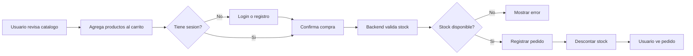
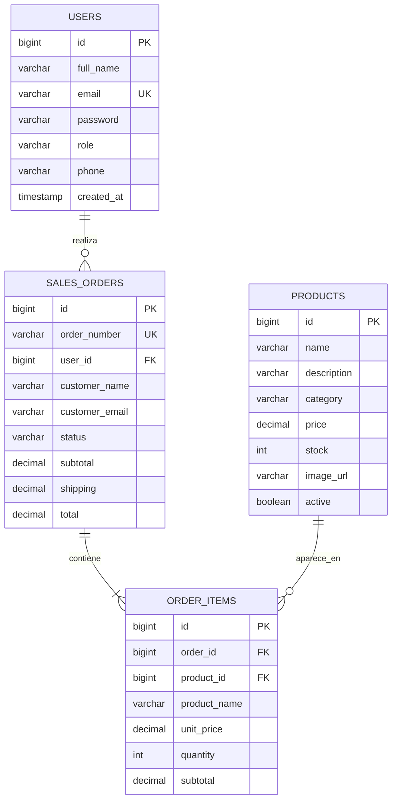
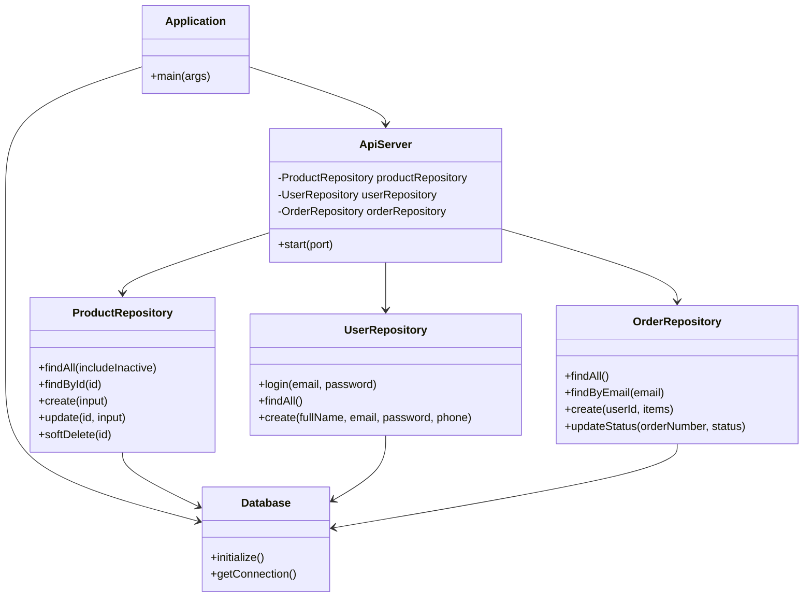
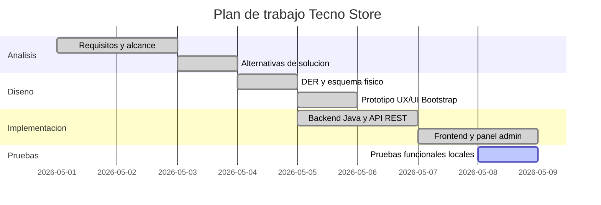

# Diseno tecnico de la solucion

## Project Charter basico

| Campo | Detalle |
| --- | --- |
| Proyecto | Tecno Store |
| Objetivo | Crear un prototipo ecommerce con catalogo, carrito, usuarios, administrador y base de datos. |
| Alcance | Frontend Bootstrap, backend Java, BD H2, CRUD de productos, pedidos y usuarios. |
| Usuarios | Cliente y administrador. |
| Entregables | Codigo fuente, scripts SQL, API REST, documentacion tecnica. |
| Restricciones | Proyecto academico, seguridad en modo demo, ejecucion local. |

## BPM: proceso de compra

## DER logico

## Diagrama de clases UML

## Gantt

