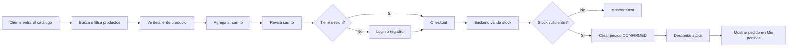
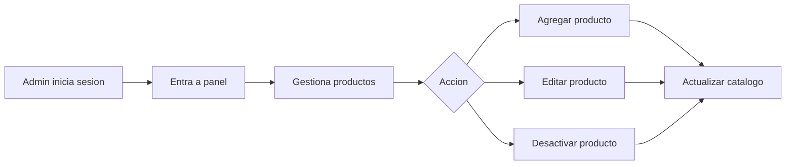

# 05. BPM de procesos

## Proceso de compra

```mermaid
flowchart LR
    A[Cliente entra al catalogo] --> B[Busca o filtra productos]
    B --> C[Ve detalle de producto]
    C --> D[Agrega al carrito]
    D --> E[Revisa carrito]
    E --> F{Tiene sesion?}
    F -- No --> G[Login o registro]
    F -- Si --> H[Checkout]
    G --> H
    H --> I[Backend valida stock]
    I --> J{Stock suficiente?}
    J -- No --> K[Mostrar error]
    J -- Si --> L[Crear pedido CONFIRMED]
    L --> M[Descontar stock]
    M --> N[Mostrar pedido en Mis pedidos]
```

## Proceso administrador

```mermaid
flowchart LR
    A[Admin inicia sesion] --> B[Entra a panel]
    B --> C[Gestiona productos]
    C --> D{Accion}
    D --> E[Agregar producto]
    D --> F[Editar producto]
    D --> G[Desactivar producto]
    E --> H[Actualizar catalogo]
    F --> H
    G --> H
```
