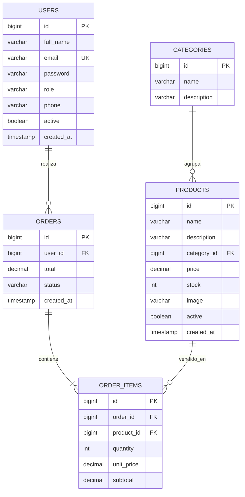

# 06. Base de datos

## Tablas

- `users`: compradores y administradores.
- `categories`: clasificacion del catalogo.
- `products`: productos activos o desactivados.
- `orders`: pedidos por usuario.
- `order_items`: detalle de cada pedido.

## DER

