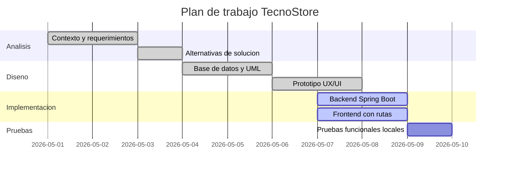

# 10. Gantt

```mermaid
gantt
    title Plan de trabajo TecnoStore
    dateFormat  YYYY-MM-DD
    section Analisis
    Contexto y requerimientos      :done, a1, 2026-05-01, 2d
    Alternativas de solucion       :done, a2, after a1, 1d
    section Diseno
    Base de datos y UML            :done, d1, 2026-05-04, 2d
    Prototipo UX/UI                :done, d2, after d1, 2d
    section Implementacion
    Backend Spring Boot            :active, i1, 2026-05-07, 2d
    Frontend con rutas             :active, i2, 2026-05-07, 2d
    section Pruebas
    Pruebas funcionales locales    :p1, 2026-05-09, 1d
```
